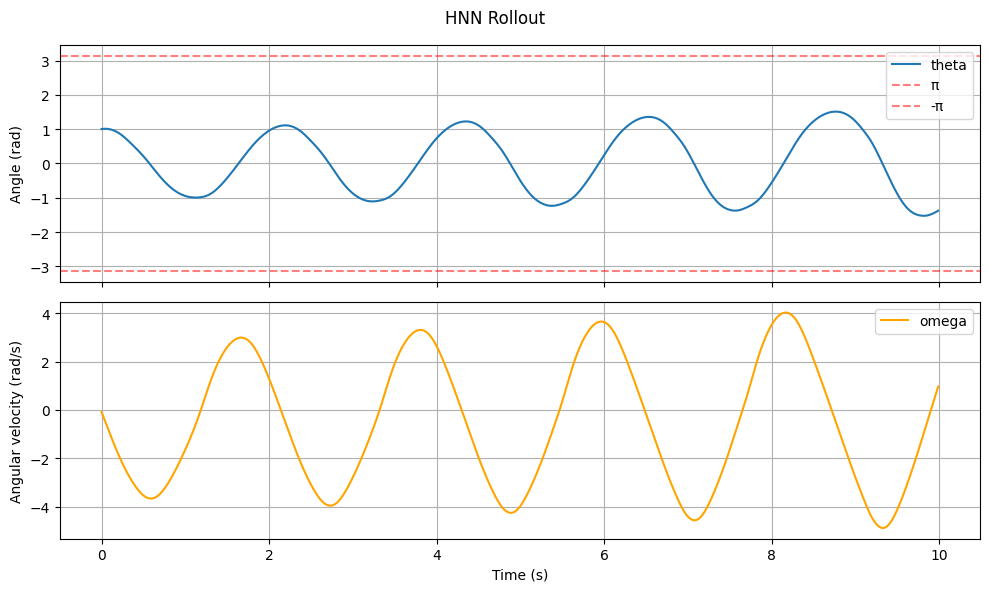
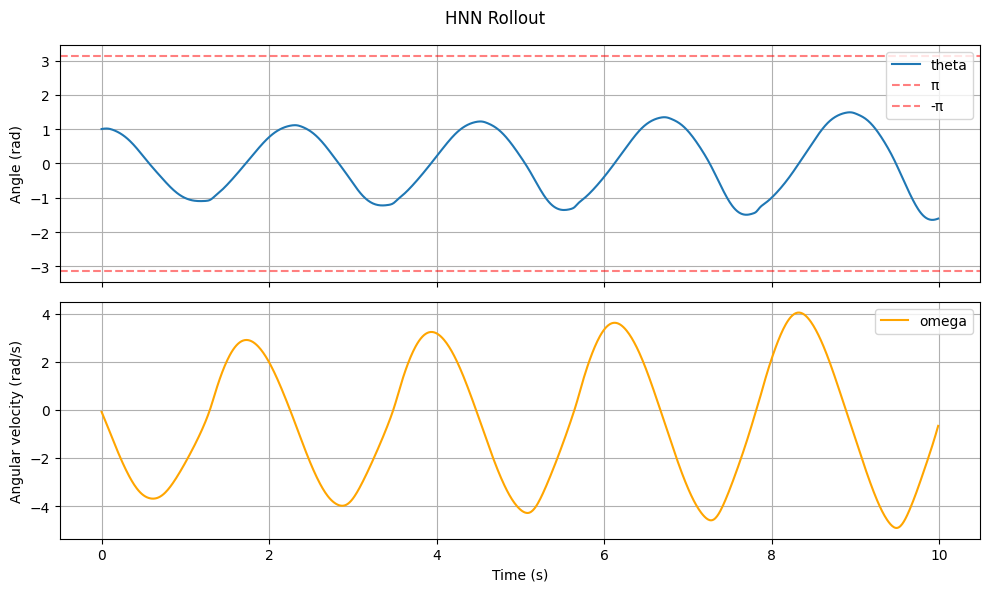
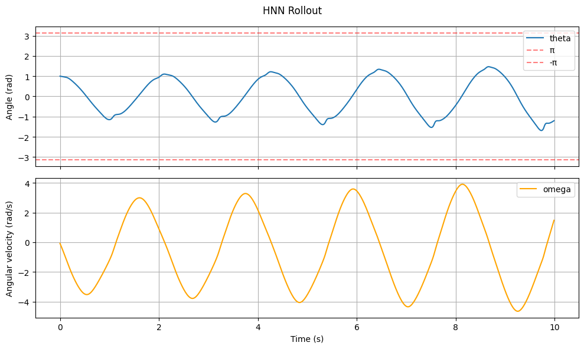
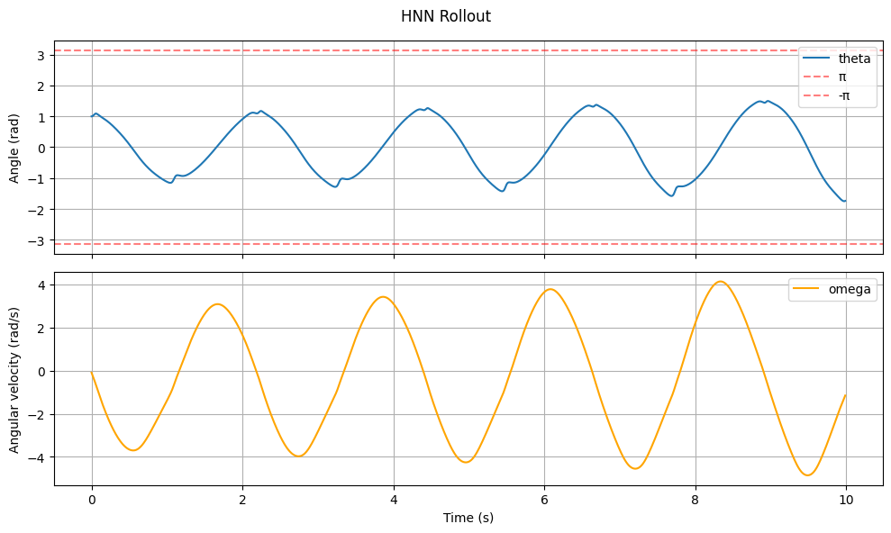
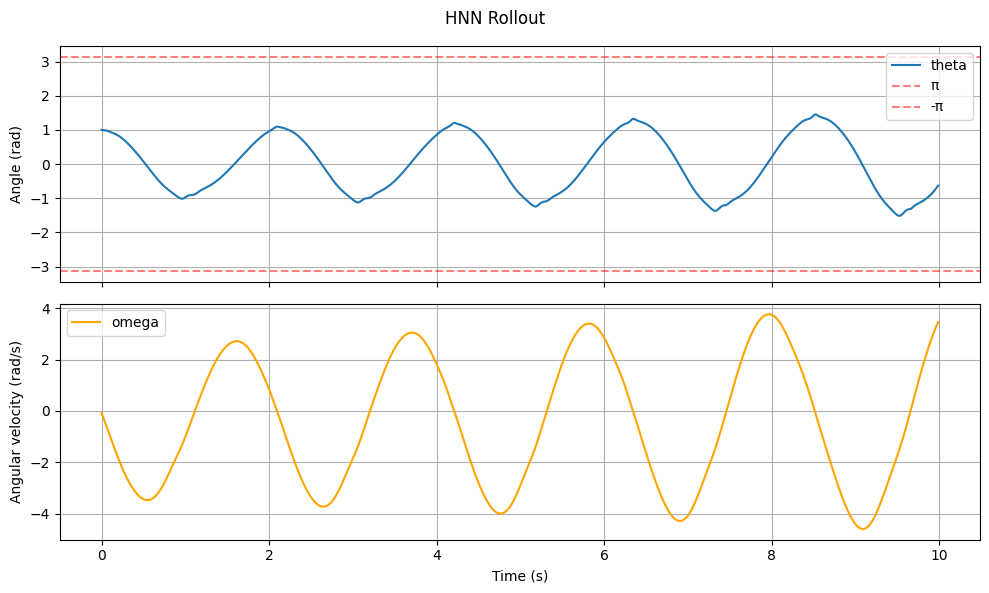

# HNN Results

## Method

1. Simulate mujoco pendulum with various initial positions, collecting current angular position, current angular velocity, next angular position, and next angular velocity (same for all)
2. HNN was trained on inputs of current angular position/velocity, outputting a single scalar representing the total energy (Hamiltonian) of the system. The dynamics are never predicted directly, rather Hamilton's equations $\dot{\theta} = \frac{\partial H}{\partial \omega}$ and $\dot{\omega} = -\frac{\partial H}{\partial \theta}$ are computed via automatic differentiation of the network output with respect to its inputs. The loss was computed as MSE between these predicted derivatives and finite difference approximations of the true derivatives $\dot{\theta} \approx \frac{\theta_{t+1} - \theta_t}{\Delta t}$ and $\dot{\omega} \approx \frac{\omega_{t+1} - \omega_t}{\Delta t}$ from the MuJoCo data. Rollout was performed by integrating the predicted derivatives forward using an Euler step. Adam optimizer, lr=1e-3 with 200 epochs.

| num_hidden | num_layers | test_mse | oscillation graph |
| :--- | :--- | :--- | :--- |
| 6 | 2 | 0.654808 |  |
| 8 | 2 | 1.175400 |  |
| 16 | 2 | 1.198357 |  |
| 20 | 2 | 1.688425 |  |
| 32 | 2 | 1.409718 |  |

## Results

The test MSE was the highest throughout all the neural networks tested, but the oscillatory nature of the pendulum was captured best in the HNN. Another interesting note is that a *smaller number of layers* seemed to have better performance with respect to predictions for the angular velocity. The largest issue with the HNN is that the total energy appeared to slowly creep higher as the system continued inference. This could likely be circumvented by adding a loss value handling the total energy of the system at consecuitive states.