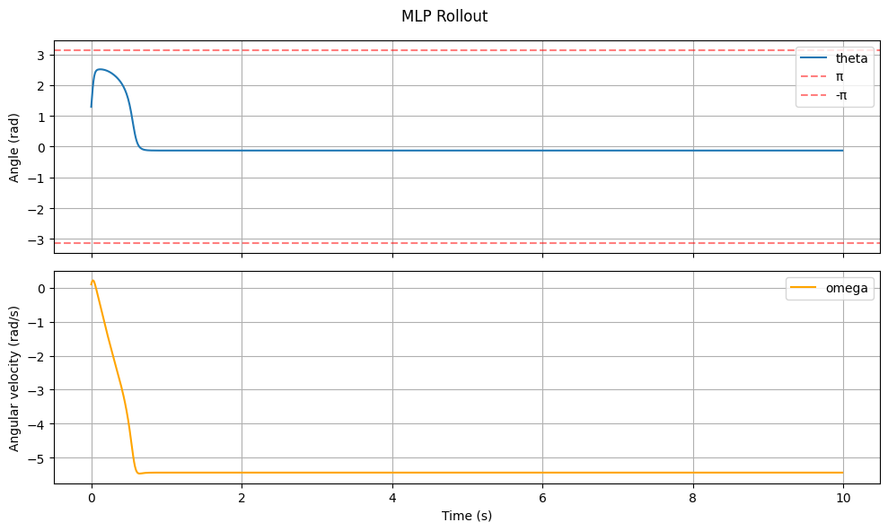
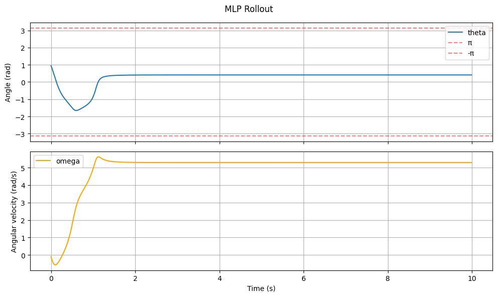
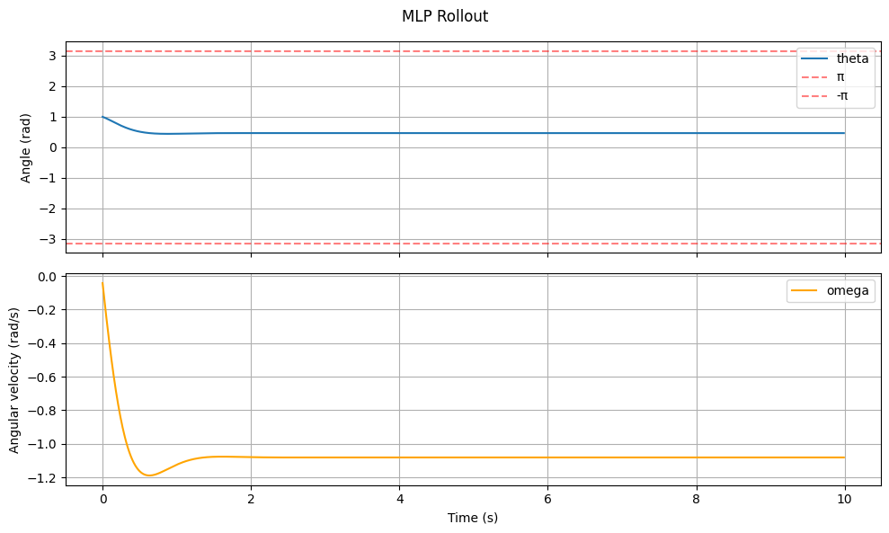

# MLP Results

## Method
1. Simulate mujoco pendulum with various initial positions, collecting current angular position, current angular velocity, next angular position, and next angular velocity (same for all)
2. Train naive MLP with inputs of current angular position/velocity, predicting next angular position/velocity. Adam Optimizer and `lr=1e-3` with 30 epochs

| num_hidden | num_layers | test_mse | oscillation graph |
| :--- | :--- | :--- | :--- |
| 4 | 2 | 0.099513 |  |
| 8 | 2 | 0.003512 |  |
| 16 | 2 | 0.001513 |  |

## Results

Even though MSE was really low, and decreased throughout the layers, the oscillatory nature of the pendulum was not captured by the neural network, showing that the MLP was unable to learn the underlying physics in the system
