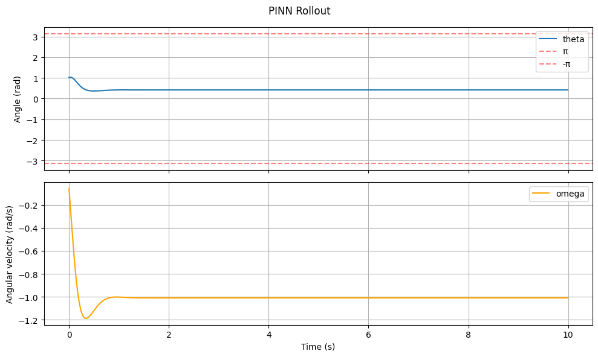
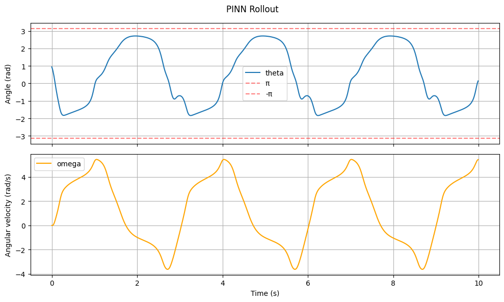
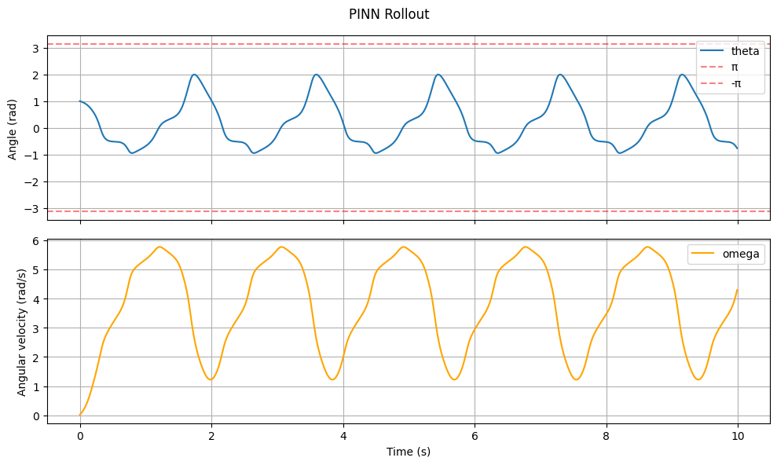
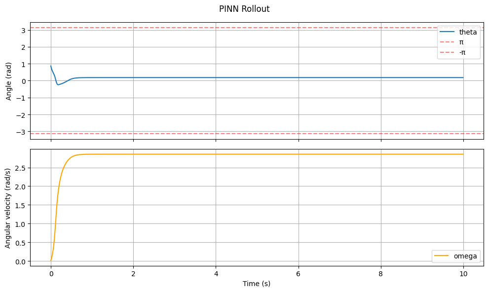

# PINN Results

## Method

1. Simulate mujoco pendulum with various initial positions, collecting current angular position, current angular velocity, next angular position, and next angular velocity (same for all)
2. PINN was trained on inputs of current angular position/velocity, predicting next angular position/velocity. Actual neural network architecture was the same as MLP, but the loss term included the expected calculated angular acceleration vs the actual calculated angular acceleration using formula $\theta^{..}=-\frac{g}{L}sin(\theta)$ where $g=9.81$ (gravity of system), $L=1.0$ (length of pendulum) and $\theta$ is next angular position. Adam Optimizer and `lr=1e-3` with 200 epochs

| num_hidden | num_layers | test_mse | oscillation graph |
| :--- | :--- | :--- | :--- |
| 8 | 2 | 0.002238 |  |
| 16 | 2 | 0.011074 |  |
| 20 | 2 | 0.009696 |  |
| 32 | 2 | 0.006778 |  |

## Results

MSE was still low, but still was not indicitave of performance. Results did appear to indicate that there is a "sweet spot" for the number of layers, as both `8` and `32` layers failed to capture oscillatory nature of pendulum, but `16` and `20` were able to. That being said, the oscillations were not super clean and didn't really demonstrate a pendulum's actual motion